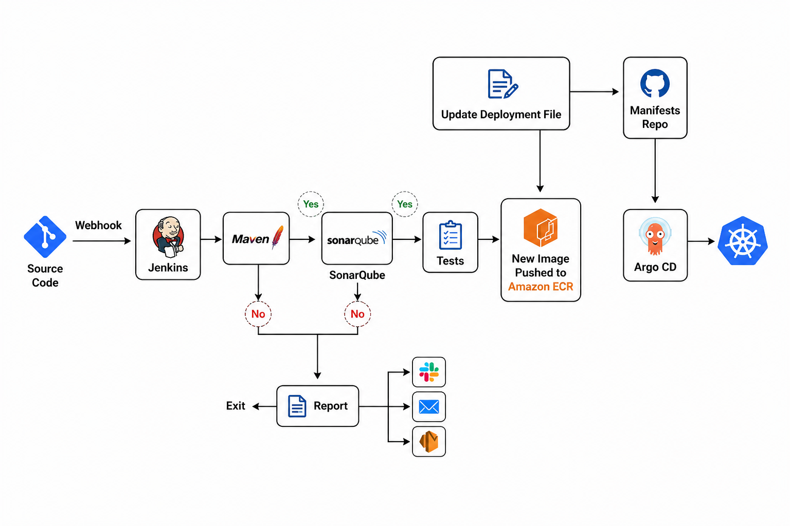
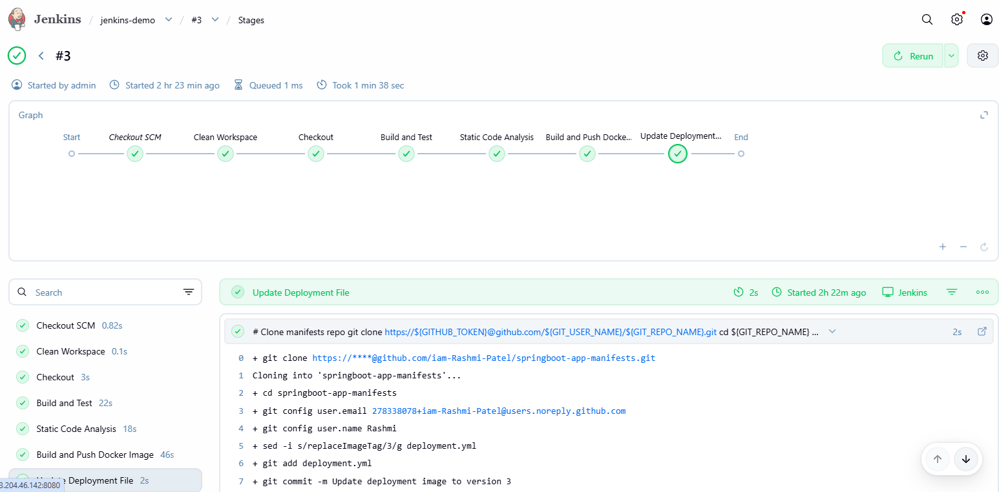
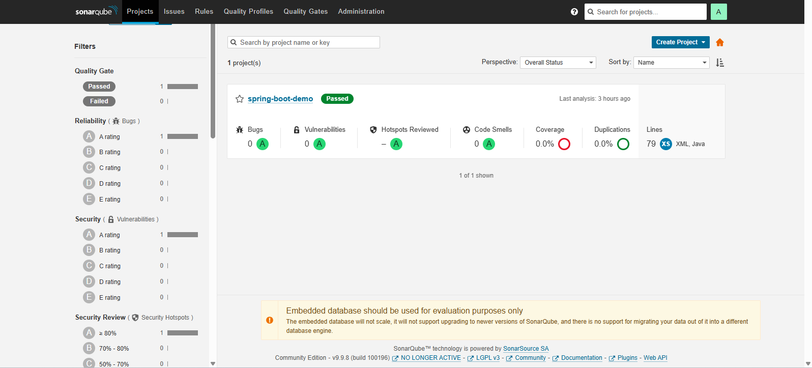
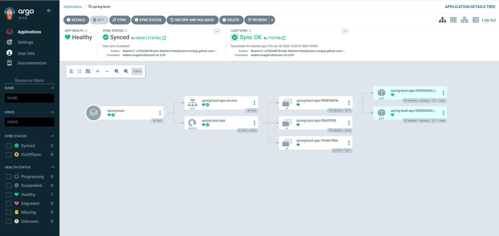
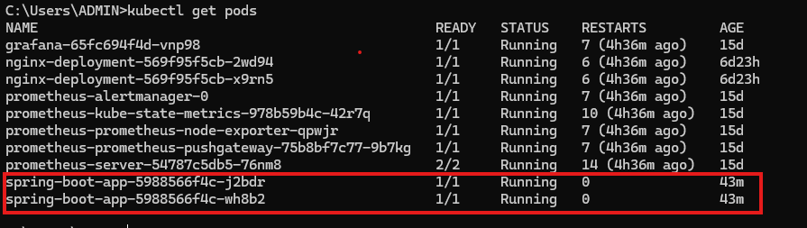
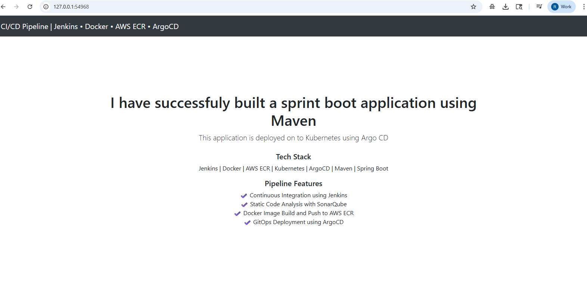

# End-to-End CI/CD Pipeline with Jenkins, Argo CD, and Kubernetes

## Project Overview

This project demonstrates a complete **End-to-End CI/CD pipeline** for a Spring Boot application using:

* **Jenkins** for Continuous Integration (CI)
* **Docker** for containerization
* **AWS ECR** for image storage
* **Argo CD** for GitOps-based Continuous Deployment (CD)
* **Kubernetes (Minikube)** for container orchestration

---

## CI/CD Pipeline Architecture



> 🔗 The pipeline uses a separate manifests repository to follow GitOps principles, where deployment configurations are version-controlled independently.

1. Developer pushes code to GitHub
2. Jenkins pipeline is triggered
3. Jenkins:

   * Builds the application using Maven
   * Runs static code analysis (SonarQube)
   * Builds Docker image
   * Pushes image to AWS ECR
   * Updates Kubernetes manifests repo
4. Argo CD detects changes in manifests repo
5. Argo CD syncs and deploys to Kubernetes
6. Application is exposed via NodePort

---

## Tech Stack

* Java (Spring Boot)
* Maven
* Docker
* Jenkins
* AWS ECR
* Kubernetes (Minikube)
* Argo CD
* GitHub

---

## ⚙️ Jenkins Pipeline Stages

* ✅ Checkout Code
* ✅ Build & Test (Maven)
* ✅ Static Code Analysis (SonarQube)
* ✅ Docker Build & Push to ECR
* ✅ Update Kubernetes Manifests

---

## 🔐 Handling Private ECR Access

Since AWS ECR is private, Kubernetes uses:

* `imagePullSecrets` for authentication
* Secret created using AWS CLI

---

## Deployment with Argo CD

* GitOps approach using manifests repository
* Automatic sync enabled
* Tracks changes in Git and deploys to cluster

---

## Application Access

The application is exposed using **NodePort**:

```bash
minikube service spring-boot-app
```

OR access via:

```
http://<minikube-ip>:<nodeport>
```

---

##  Screenshots

### 🔹 Jenkins Pipeline Execution



### 🔹 Static Code Analysis (SonarQube)



### 🔹 Argo CD Application Sync




### 🔹 Running Pods



### 🔹 Application UI



---

## 📂 Repositories

This project follows a GitOps approach and is split into two repositories:

### 🔹 Application Repository
Contains:
- Spring Boot source code
- Jenkins pipeline (CI)
- Docker build configuration

👉 https://github.com/iam-Rashmi-Patel/springboot-jenkins-argocd-pipeline

---

### 🔹 Kubernetes Manifests Repository
Contains:
- Kubernetes deployment and service YAML files
- Image tag updates triggered by Jenkins

👉 https://github.com/iam-Rashmi-Patel/springboot-app-manifests

---

## ✅ Key Achievements

* Implemented full CI/CD pipeline
* Integrated Jenkins with Docker & AWS ECR
* Used Argo CD for GitOps deployment
* Resolved ImagePullBackOff using imagePullSecrets
* Successfully deployed and accessed application on Kubernetes

---

## ⚠️ Challenges Faced & Fixes

* Docker not found in Jenkins agent → Fixed by proper environment setup
* ECR authentication issue → Fixed using Kubernetes secret
* ArgoCD path issue → Corrected manifest path
* ImagePullBackOff → Fixed using imagePullSecrets
* Git push conflicts → Resolved using rebase

---

## Future Improvements

* Use AWS EKS instead of Minikube
* Implement Helm charts
* Add monitoring (Prometheus + Grafana)
* Automate secret rotation

---

## Acknowledgement

* This project uses a sample Spring Boot application inspired by a tutorial by Abhishek Veearamalla
* The application was customized and extended with a complete CI/CD pipeline using Jenkins, Docker, AWS ECR, and Argo CD.


## 👩‍💻 Author

Rashmi C  
DevOps Engineer  

🔗 GitHub: https://github.com/iam-Rashmi-Patel

🔗 LinkedIn: <https://www.linkedin.com/in/rashmi-c-b6b456163?utm_source=share_via&utm_content=profile&utm_medium=member_android>
